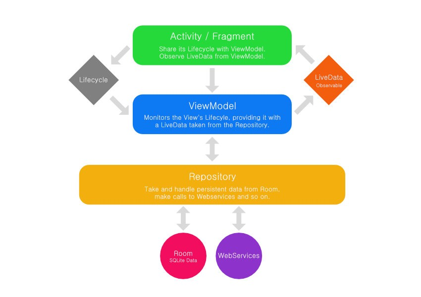

# AAC 

- 소개   
우선 AAC는 Android Architecture Components 약자이다.  
안드로이드의 표준 아키텍쳐라고 생각하면 된다 

- 배경  
내가 안드로이드 처음 만났을 때도 mvc&mvvm&mvp 다양한 패턴이 존재 하였으면 각각의 아키턱쳐를 사용하기 위해서는
방식에 맞는 라이브러리를 사용하게 되었고 이러한 라이브러리는 공식지원도 안되고 유지보수나 테스트하기 힘든 코드로 이어지게 되었다.  
이를 해결하기위해 구글에서 표준을 만들어주게 되었다. 이게 바로 AAC의 탄생배경이다. 

- AAC 소개전 Andtoid Architecture 란?   
안드로이드 뿐만 아니라 다양한 플렛폼에 적용되는 이야기이다.  
사용자들은 프로그램이 돌아가는 겉을 보게 되지만 개발자들은 그 프로그램이 돌아가는 내부 즉 안에 있는 코드를 구성하고 만들게 된다. 그 코드가 구성되어있는 구조 큰 틀을 만들기 위해 많은 개발자들은 아키텍쳐를 설계하게 된다.
    
    안드로이드에서도 깨끗하게 구현된 서비스를 구현하기 위해 여러 아키텍쳐들이 나왔고 각각의 방식마다 주 기능, Ui처리, 네트워크 통신 어플리케이션 층에서 다양하게 구현이 되었다. 

- AAC 구조  
       
    - **View**  
    View는 activity, fragment를 말한다. view 에서는 기능을 수행하는 것이 아니라 Ui만 컨트롤 한다고 생각하면 된다. 여기서 가장 중요한 내용은 ViewModel의 LiveData를 관찰하면서 Ui 상태를 알려주는 것 이다. 
    쉽게 말하면 ViewModel이 주 기능을 수행하면서 데이터에 변화를 주면 View는 그 데이터를 관찰하면서 사용자가 어떤 기능(로그인, 사용자 리스트 , 마이페이지 등등)을 수행했는지 보고 Ui를 업데이트 해준다. 
    - **View Model**  
    View가 유지되는 동안 LifeCycle을 상태를 관찰한다.   
    LiveData는 Repository에 의헤 제공받게 되고 ViewModel은 View를 참조를 않하고 즉 View의 업데이트를 View Model에서 진행 하지않고 View가 LiveData를 관찰하면서 진행된다.
    - **Repository**  
    Repository는 구글에서 제공하는 컴포넌트는 아니다. 데이터베이스, 네트워크 작업에 대한 데이터를 가져오는 역할을 한다. 가져올 때는 LiveData로 변환해서 ViewModel에게 전달해준다. 
    - **Room**  
    Room은 Sqlite 매핑 라이브러리이다. 다른 안드로이드에서 사용하는 데이터베이스와 큰 틀은 비슷하지만 
    LiveData가 있는 쿼리를 만들고 반환이 가능하다.

- 프로젝트에 AAC에 적용하는 방법  
[Android Developers](https://developer.android.com/topic/libraries/architecture/adding-components)

