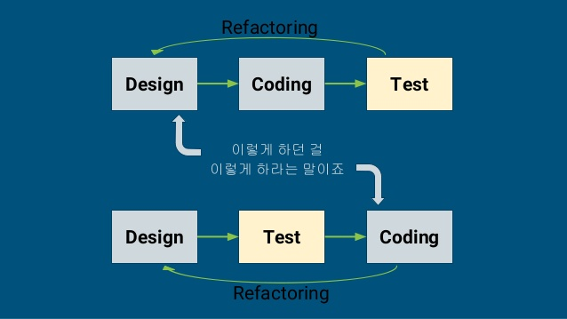

## TDD 란?  

테스트 주도 개발(Test-driven development)의 약자로 짧은 개발사이클 반복하는 소프트웨어 개발 프로세스 입니다.

## TDD 방식
개발자는 각 기능에 대한 함수, 바라는 로직에 대한 자동화된 케이스를 작성한다.
그에 대한 최소한의 테스트 케이스를 작성하고 
완료된 테스트 케이스로 리팩토링을 한다.   

  

## TDD 세가지 규칙
You are not all allowed to write any production unless it is to make a failing unit test pass 
실패하는 테스트를 작성하기 전에는 전에는 제품 코드를 작성하지 않는다. 
You are not allowed to write any more of a unit test is sufficient to fail 
실패하는 테스트 코드를 한번에 하나 이상 작성하지 않는다. (컴파일 에러도 실패다)
You are not allowed to write any more production code than is sufficient to pass the one failing unit test
현재 실패한 테스트 코드를 성공 시키는데 충분한 정도로만 제품 코드를 작성한다.  

---
출처
https://www.slideshare.net/koreakihoon/tdd-android-unit-test